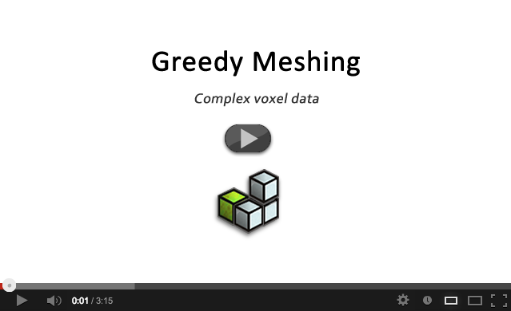

# Greedy meshing for complex voxel data

This is a Java greedy meshing implementation based on the javascript implementation written by Mikola Lysenko and described in this blog post:

[http://0fps.wordpress.com/2012/06/30/meshing-in-a-minecraft-game/](http://0fps.wordpress.com/2012/06/30/meshing-in-a-minecraft-game/ "http://0fps.wordpress.com/2012/06/30/meshing-in-a-minecraft-game/")
 
The principal changes are:
 
* Porting to Java
* Modification in order to compare *voxel faces*, rather than voxels themselves
* Modification to provide for comparison based on multiple attributes simultaneously

Here is a video showing this implementation being used in a complex voxel engine, to produce greedy meshes in real time.

This project is set up for use in JMonkey directly - but the meshing algorithm is fully commented and should be usable on any platform. The full implementation is contained in Main.java.

Enjoy!

## Author

Robert O'Leary - based on the work of [Mikola Lysenko](http://0fps.wordpress.com/)